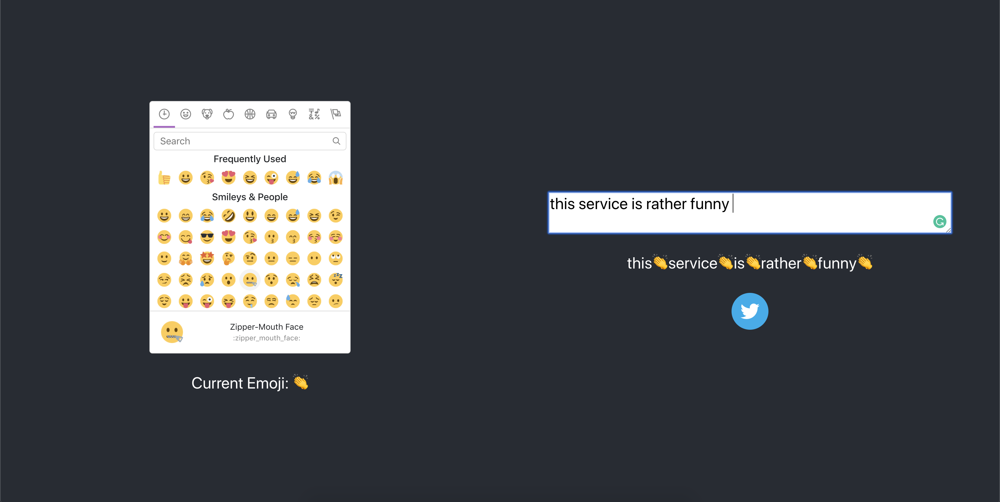
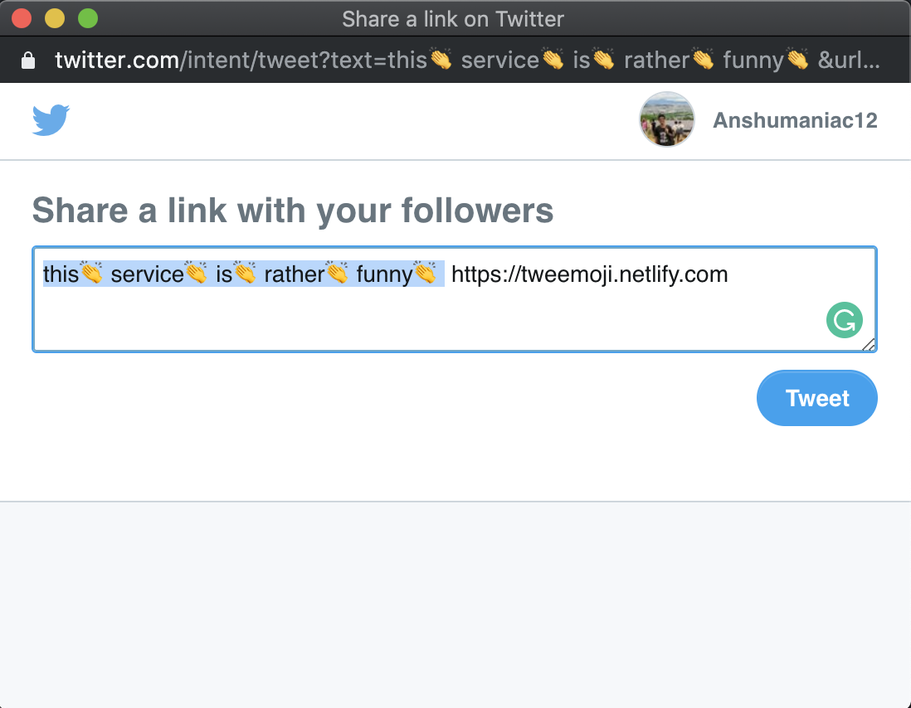

# tweemoji

> trendy simple emojified tweets.

## How to use?

1. Write some text, pick and emoji

2. Tweet directly

### Dev

* npm i && npm start

#### Todo - 

* Write a proper README
* Fix bad UI

##### W-Why is this?
Meh, was bored on a weekend and saw a lot of emojified tweets.
